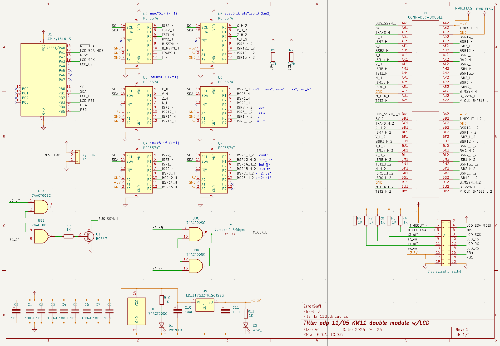
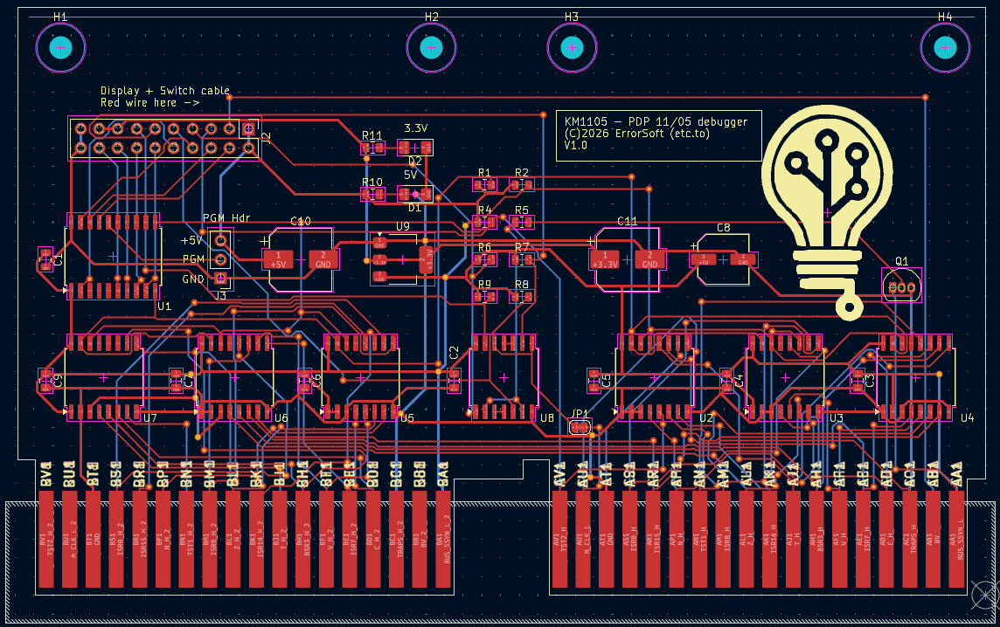
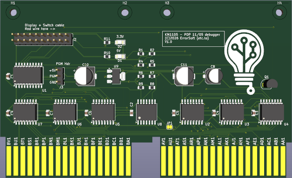
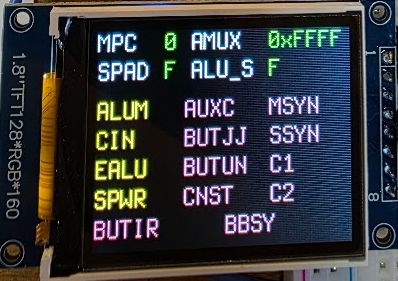
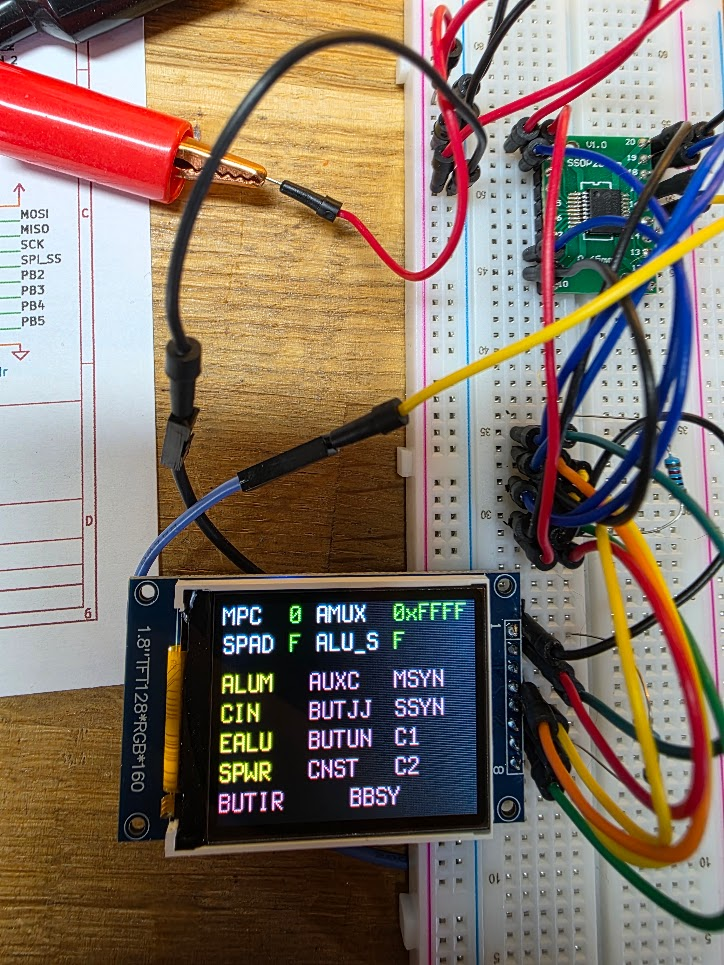
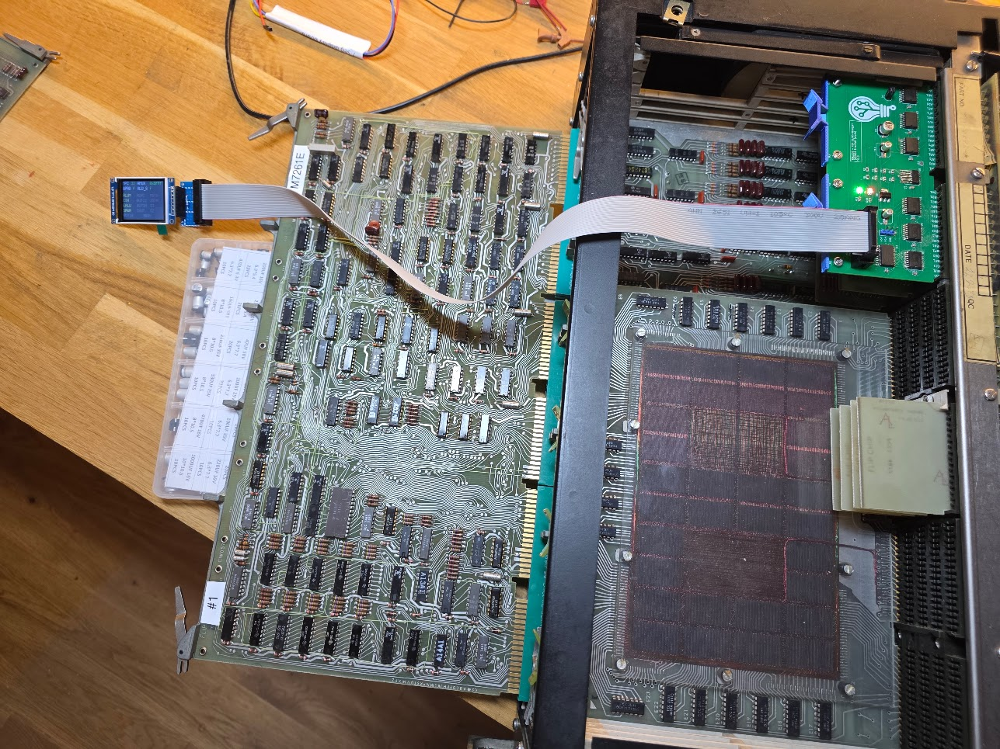
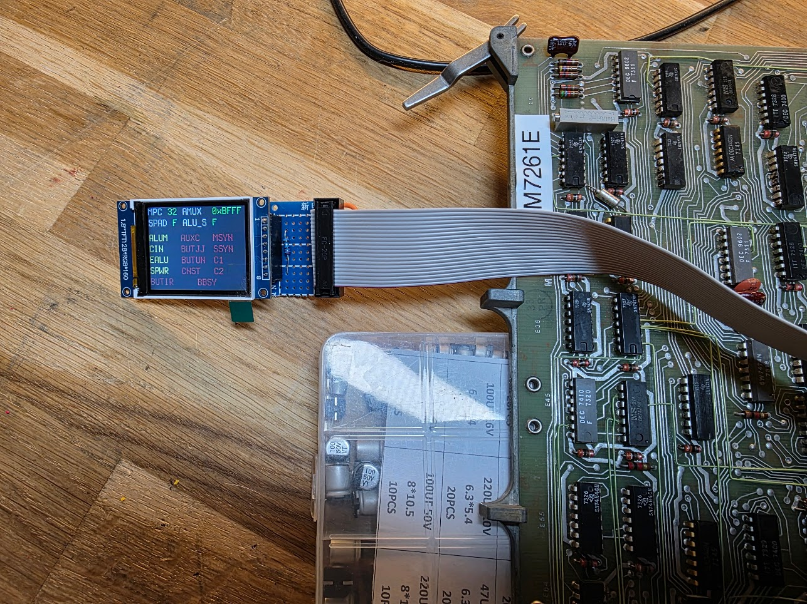

# Pdp-11 KM11 Maintenance Module with LCD screen

This is supposed to become a KM11 maintenance module. It is a 2 slot card which should 
be placed in both KM11 slots of a PDP 11/05 or 11/10. It uses an ATTINY1616 (or 3216 
if I cannot make the code fit) and a set of i2c I/O adapters (PCF8574T) to read the data
from both slots for the KM11, and writes those to an LCD screen, offset on a cable.

The main PCB must be placed in the PDP 11/05. The LCD display and the switches sit on
a second, small PCB (`kicad/kmdisp`) at the end of a 20-way ribbon cable, so they can be
outside the pdp/11 in the 3D-printed console from `3d/`.

## Hardware

The board uses:

* An ATTINY1616 (or ATTINY3216) as the controller
* Six PCF8574T I2C extenders to connect to both KM11 slots
* A 1.8" 160x128 LCD display to show the data

A PCB has been requested for the first version, let's hope it works :smile:

## Schematic and PCB views, version 1

This version had some issues, so a respin is being done.

## Code

The code was partially created by Claude, and does not use the usual libraries to save space 
in the Flash memory of the ATTINY1616 as it only has 16K. The code directly accesses registers
to control both the ST7735 LCD controller and the I2C extenders, and contains two fonts (5x7 
and 8x16).

At the time of writing the code takes 3974 bytes of the 16KB Flash available.

The code is just a tight loop which reads all data from the extenders, and then updates the
entire screen. The screen currently looks like this:

This shows the data for both the KM1 and KM2 slots. Signals that were shown inverted on the
original KM11 (like the MPC address, ALU_S* and some flags) are inverted before shown so that
their actual value is visible.

The single signals are shown in yellow when asserted, and in red when negated.

MPC and AMUX are shown in octal, the way DEC writes them in the microprogram flow charts and on
the console. Two things from the KD11-B manual (EK-KD11B-MM-001, section 5.9) worth knowing when
reading the screen: the MPC is the address of the *next* microstep, not the one being executed,
and C1/C0 together give the Unibus cycle type (00 DATI, 01 DATIP, 10 DATO, 11 DATOB).

The four switches are BUS SSYN, AC LO, M CLK PULSE (STEP) and M CLK ENABLE. The AC LO one sits
on the KM11 pin the 11/20 used for NO TIMEOUT, and the net is still called `TIMEOUT_H` for that
reason; on the 11/05 throwing it asserts BUS AC LO and starts the power-fail sequence.

`review.md` records the September 2026 check of the design and firmware against DEC's own
documentation, with the sources.

## Programming

To program the ATTINY1616 please follow the setup and instructions from [my 8bit bus display tool](https://github.com/fjalvingh/8bit-busdisplay).

## Testing

I made a small test setup to test driving the display:

The initial idea was to use a fancy 2.25 landscape mode LCD to show the info, but after almost 4 hours
of testing and messing around with the code I gave up, I assume the display I got was defective. I was not helped by the fact that the second display tested, now the 1.8" display, was ALSO found to be defective, wasting another few hours. In the end I proved that of the 5 1.8" displays I have 1 was defective, and I had to pick that one for the test, obviously. Murphy in full working order.

## The first version in an actual PDP 11/10 (same as 11/05)

More closeup:

