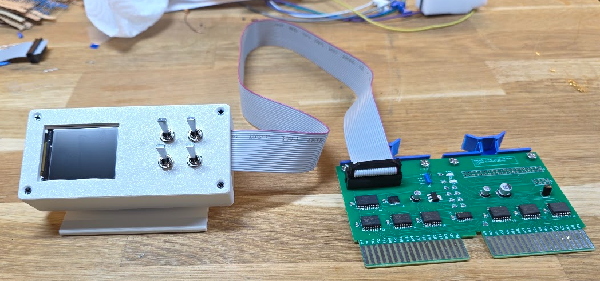
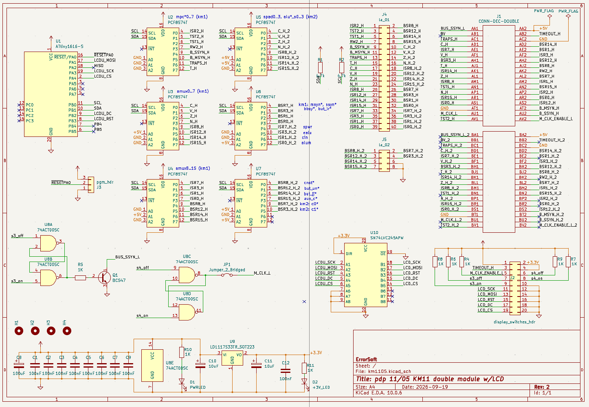
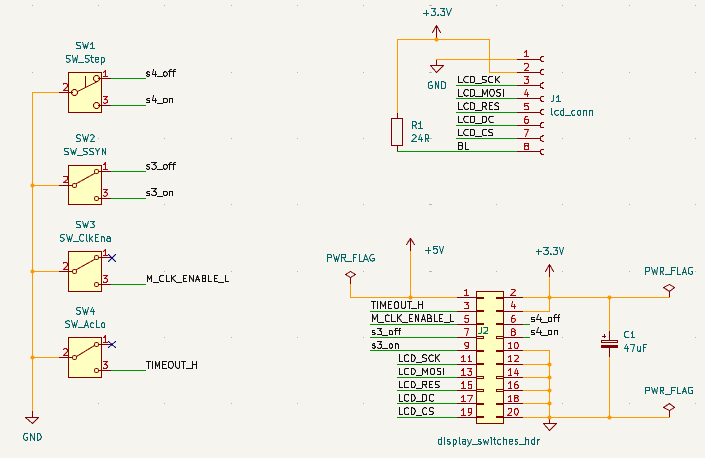
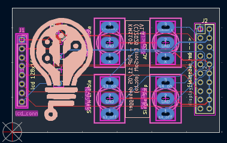
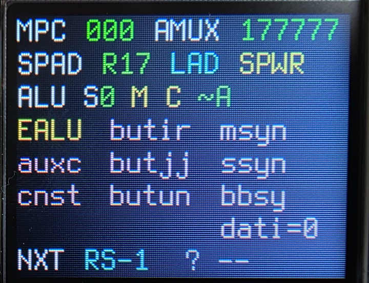
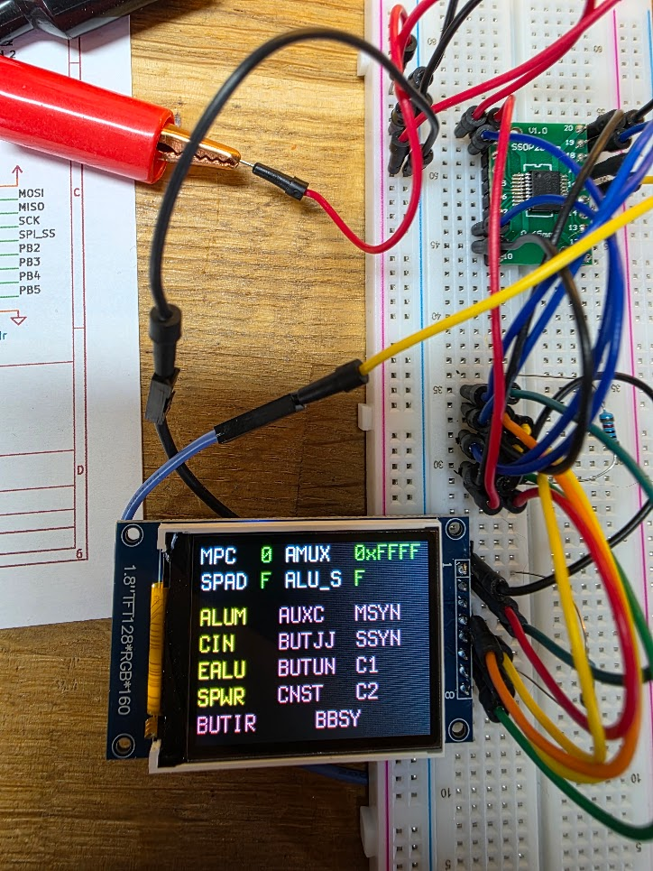
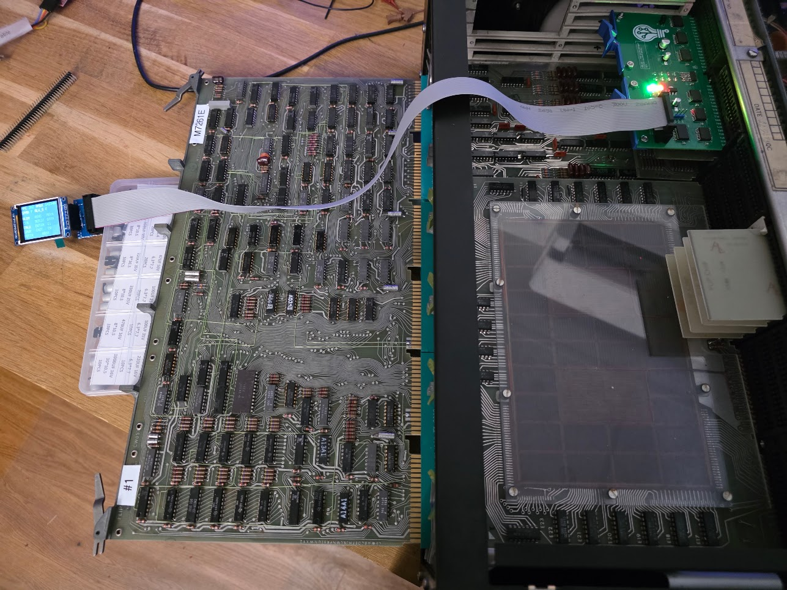
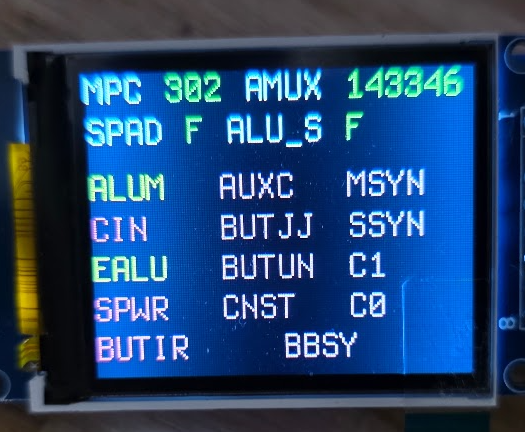

# Pdp-11 KM11 Maintenance Module with LCD screen

This is supposed to become a KM11 maintenance module. It is a 2 slot card which should 
be placed in both KM11 slots of a PDP 11/05 or 11/10. It uses an ATTINY1616 (or 3216 
if I cannot make the code fit) and a set of i2c I/O adapters (PCF8574T) to read the data
from both slots for the KM11, and writes those to an LCD screen, offset on a cable.

The main PCB must be placed in the PDP 11/05. The LCD display and the switches sit on
a second, small PCB (`kicad/kmdisp`) at the end of a 20-way ribbon cable, so they can be
outside the pdp/11 in the 3D-printed console from `3d/`.



## Hardware

The board uses:

* An ATTINY1616 (or ATTINY3216) as the controller
* Six PCF8574T I2C extenders to connect to both KM11 slots
* A 1.8" 160x128 LCD display to show the data

## Schematic and PCB views, version 1.1

The first version had some small issues which were repaired in this version.



## Display and switches board





## Code

The code was partially created by Claude, and does not use the usual libraries to save space 
in the Flash memory of the ATTINY1616 as it only has 16K. The code directly accesses registers
to control both the ST7735 LCD controller and the I2C extenders, and contains two fonts (5x7 
and 8x16).

At the time of writing the code takes about 9.3KB of the 16KB Flash available.

The code is a loop that reads all six extenders about ten times a second and repaints only
what changed. An earlier version of the screen, before the layout described below:



### What the screen shows

```
MPC 302  AMUX 000000
SPAD R7  PC  spwr
ALU SF M c A
EALU BUTIR msyn
auxc butjj ssyn
cnst butun bbsy
          dati=0
NXT H-2  E OK
```

* **MPC** – the microprogram counter (octal). This is the *next* microstep, not the one whose
  signals are on the rest of the screen (KD11-B manual EK-KD11B-MM-001, 5.9).
* **AMUX** – the 16-bit data path (octal).
* **SPAD** – the scratchpad register being addressed, numbered as DEC does (R0–R17), with its
  use: SP, PC, SRC (R10), DST (R11), VEC (R12) or LAD (R17). Then SPWR, the scratchpad write.
* **ALU** – S, the raw S3–S0 function select (hex), then M (mode) and C (carry in), then the 74181 function they select (for example `A+B+1`). The function is grey when EALU is off, because then the ALU result does not reach the AMUX.
* **Flags**, in three columns: ALU/data path (EALU, AUXC, CNST), the microprogram branch tests
  (BUTIR, BUTJJ, BUTUN), and the Unibus (MSYN, SSYN, BBSY). Below the Unibus column is the bus
  cycle from C1/C0 with its code: DATI=0, DATIP=1, DATO=2, DATOB=3. The cycle name is lit while
  MSYN is asserted.
* **NXT** – DEC's name for the microstep the MPC points at, as used in the microprogram flow
  charts.
* **Status** (bottom right) – the microcode revision and the result of the microcode check (see
  below). A red `I2C:` followed by U numbers replaces it when an extender does not answer; the
  values that extender supplies are then not real.

Signals that are active low on the backplane (and shown dim on the original KM11, like the MPC
and ALU S) are inverted first, so everything on the screen is the logical value. Single signals
are **yellow and upper case** when asserted, **red and lower case** when negated.

Colours that mark a value:

* **dark blue background** – changed since the machine last moved. When single stepping, this
  shows what the last step did, and it stays until the next step.
* **white on red** – does not match the microcode listing (see below).

### Microcode check

While the processor is single stepped (M CLK ENABLE on, M CLK PULSE to step), the firmware
compares the lamps with DEC's microcode listing for the microword that just executed. It checks
ALU S/M/C, the scratchpad address, the four BUT lamps and AUXC. The status shows:

| Status | Meaning |
| --- | --- |
| `E OK` / `F OK` | the lamps match the listing |
| `E BAD` | some lamps do not match; they are drawn white on red |
| `SEQ?` | the MPC moved to an address the previous microword cannot branch to; the MPC turns red |
| `--` | nothing to check: no step seen yet, or the clock is running |

The first letter is the microcode revision of the M7261: `E` (1973) or `F` (1976), or `?` until
it is known. The card finds out by itself. The two revisions differ only in 14 microwords, and
the first time a step passes one of them, the AUXC lamp shows which revision is installed. Unary
instructions (CLR, INC, COM…) pass them. The revision is kept in the ATtiny's EEPROM.
`make REV=E eeprom`, `make REV=F eeprom` or `make REV=AUTO eeprom` sets or forgets it. Uploading
new firmware erases it, and it is learnt again.

The four switches are BUS SSYN, AC LO, M CLK PULSE (STEP) and M CLK ENABLE. The AC LO one sits
on the KM11 pin the 11/20 used for NO TIMEOUT, and the net is still called `TIMEOUT_H` for that
reason; on the 11/05 throwing it asserts BUS AC LO and starts the power-fail sequence.

`review.md` records the September 2026 check of the design and firmware against DEC's own
documentation, with the sources.

## Help with microcode debugging

The PDP 11/05 microcode for Rev.E and Rev.F can be browsed easily using [the microcode browser for the PDP 11/05](https://tools.etc.to/).

## Programming

To program the ATTINY1616 please follow the setup and instructions from [my 8bit bus display tool](https://github.com/fjalvingh/8bit-busdisplay). The source code is under src/. Two steps to do for a build:

* Use `make` to build the code, then
* Use `make upload` to upload the code to the board (with the programmer connected, obviously).

## The prototype

I made a small test setup to test driving the display:



The initial idea was to use a fancy 2.25 landscape mode LCD to show the info, but after almost 4 hours
of testing and messing around with the code I gave up, I assume the display I got was defective. I was not helped by the fact that the second display tested, now the 1.8" display, was ALSO found to be defective, wasting another few hours. In the end I proved that of the 5 1.8" displays I have 1 was defective, and I had to pick that one for the test, obviously. Murphy in full working order.

## The first version in an actual PDP 11/10 (same as 11/05)



More closeup:


The microcode PC is at 302~oct~, which is H-2, part of the HALT instruction.

